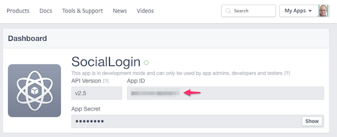
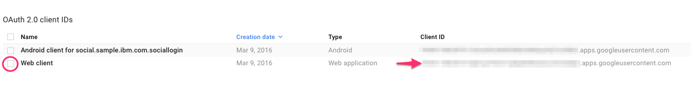
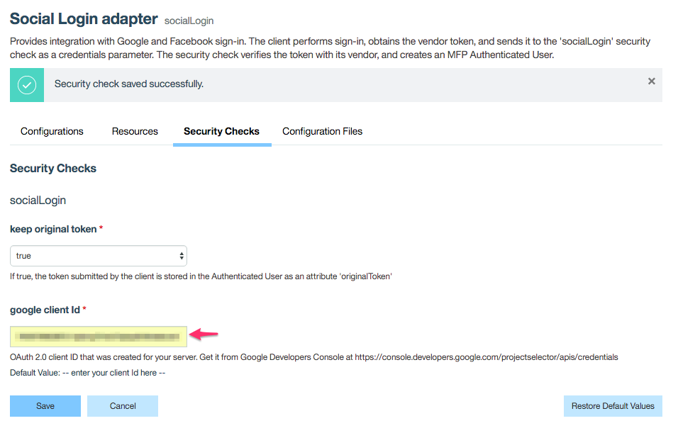

## Prerequisites
* [Installed Git](https://git-scm.com/book/en/v2/Getting-Started-Installing-Git)
* [Registered Facebook Android App](https://developers.facebook.com/docs/android/getting-started)
* [Registered Google Sign-In App for Android](https://developers.google.com/identity/sign-in/android/start-integrating#get-config)
* [Installed Android Studio](https://developer.android.com/studio/install.html)
* [Installed MobileFirst development environment](https://mobilefirstplatform.ibmcloud.com/tutorials/en/foundation/8.0/setting-up-your-development-environment/mobilefirst-development-environment/)

## Running the sample

#### Cloning the Git repository

* Clone this Git repository

* From the above repository you will need three folders:

  1. [Social Login security check](./social-login-security-check) - The social login [security check](https://mobilefirstplatform.ibmcloud.com/tutorials/en/foundation/8.0/authentication-and-security/) adapter.

  2. [HelloSocialUser Adapter](./HelloSocialUserAdapter) - The JAX-RS resource adapter which protect with the scope **socialLogin**.

  3. [SocialLoginApp](./SocialLoginApp) - The sample native android application.

#### Configuring the Android app
* **string.xml**

```xml
<resources>
    ...
    <string name="facebook_app_id">Put your Facebook app id here</string>
    <string name="google_server_client_id">Put your Google web client id here</string>
    ...
</resources>
```

  * Open the Android app [SocialLoginApp](./SocialLoginApp) in Android Studio.
  * Edit the file **string.xml**, there you need supply the following:
    * Facebook App ID from [Facebook Apps Console](https://developers.facebook.com/apps/)

    * 

    * Google Web Client ID from [Google API Console](https://console.developers.google.com/apis/credentials).

    * 

    * For the Google SignIn you also need to get the [google-services.json](https://developers.google.com/identity/sign-in/android/start-integrating#prerequisites) file.

#### Register the application on IBM MobileFirst Platform Foundation Server
  * Ensure you have installed [MobileFirst CLI](https://mobilefirstplatform.ibmcloud.com/tutorials/en/foundation/8.0/using-the-mfpf-sdk/using-mobilefirst-cli-to-manage-mobilefirst-artifacts/)
  * Open your command line in the root of the Android project
  * Register the app by typing `mfpdev app register`


#### Deploying the adapters
  * IBM MobileFirst Platform gives you several options for deploying [adapters](https://mobilefirstplatform.ibmcloud.com/tutorials/en/foundation/8.0/adapters/).
  * For each of the adapter above ([Social Login security check](./social-login-security-check) and [HelloSocialUser Adapter](./HelloSocialUserAdapter)) do the following:
    * Open command line in the root folder of the adapter.
    * Run `mfpdev adapter build`
    * Run `mfpdev adapter deploy`


#### Configuring the adapters

  * From your command line run `mfpdev server console` - this command will open your server console.
  * From the Adapters menu click on *Social Login Adapter*, and move to *Security Checks* tab.
  * Here you will find place to add your *google client id*.  This id will use the adapter to validate the Google account.
  * If you need to use the social platform token later on, set the **keep original token** attribute to be **true**.
  * 

#### Running the application
  * You can now back to your Android Studio and run the app.

### Supported Levels
IBM MobileFirst Platform Foundation 8.0

### License
Copyright 2016 IBM Corp.

Licensed under the Apache License, Version 2.0 (the "License");
you may not use this file except in compliance with the License.
You may obtain a copy of the License at

http://www.apache.org/licenses/LICENSE-2.0

Unless required by applicable law or agreed to in writing, software
distributed under the License is distributed on an "AS IS" BASIS,
WITHOUT WARRANTIES OR CONDITIONS OF ANY KIND, either express or implied.
See the License for the specific language governing permissions and
limitations under the License.
